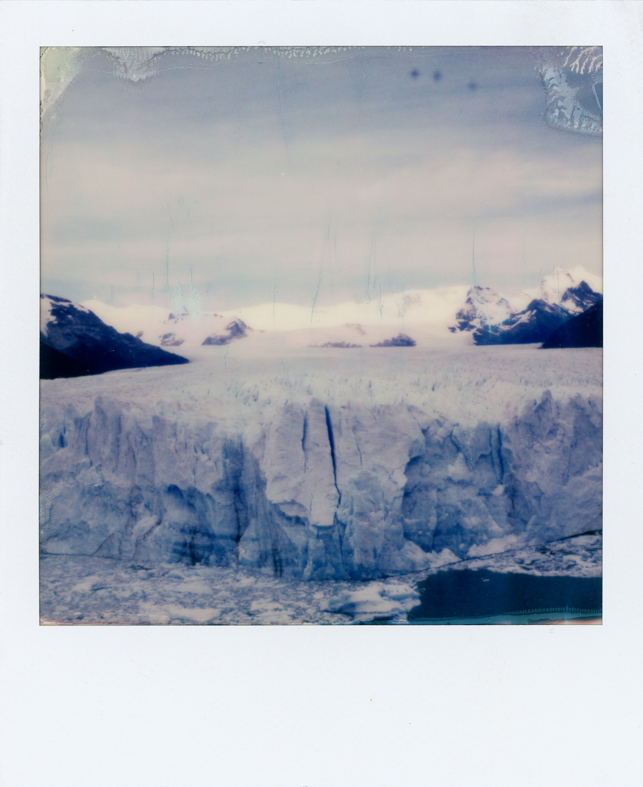
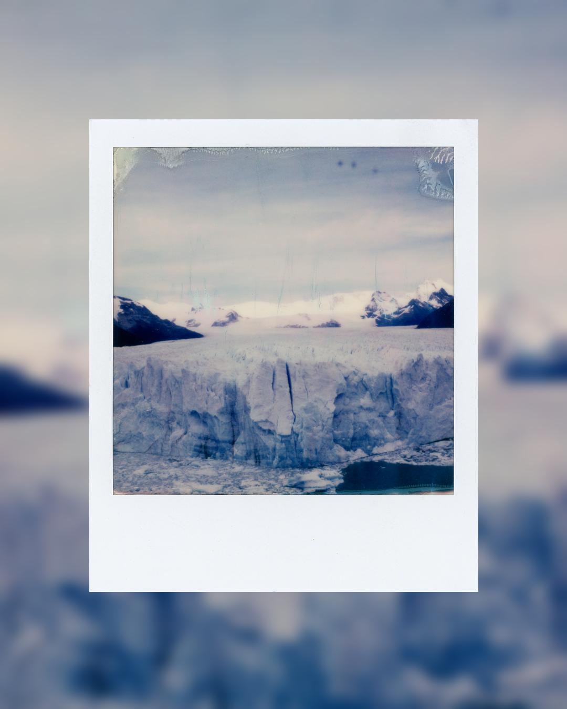
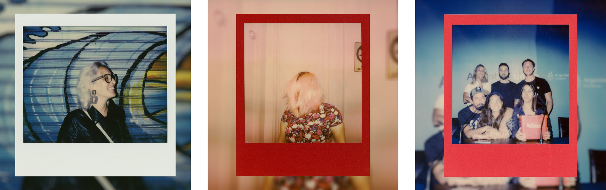
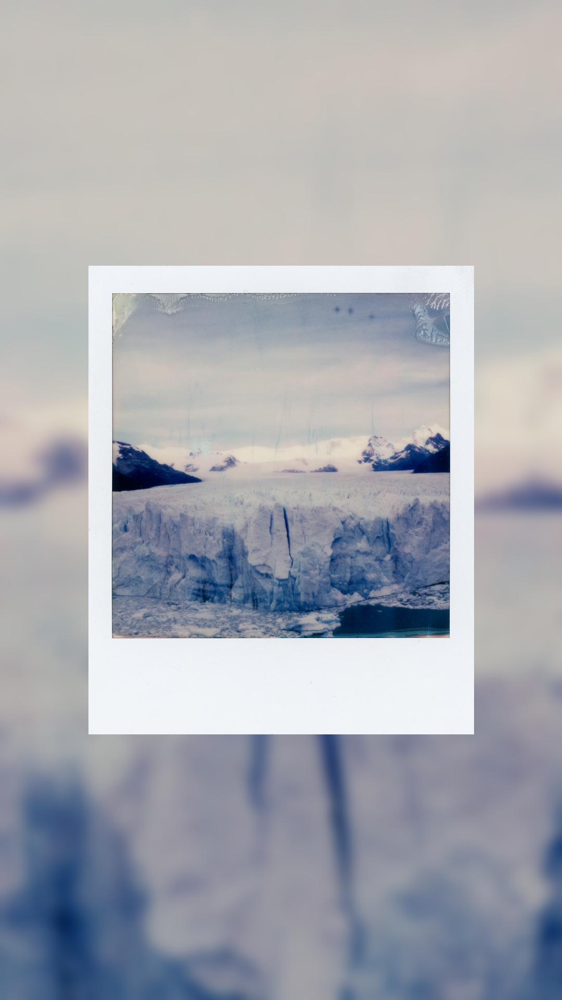

# Polaroid to Instagram

A tiny Python script to create a new _instagram-ready_ picture using the polaroid photo area as a background and placing the polaroid itself in the center of it.

## Table of Contents

- [Polaroid to Instagram](#polaroid-to-instagram)
  - [Table of Contents](#table-of-contents)
  - [About](#about)
  - [Getting Started](#getting-started)
  - [Install](#install)
    - [Requirements](#requirements)
  - [Usage](#usage)
      - [TL;DR](#tldr)
      - [Technicalities](#technicalities)
      - [Why? ¯\\\_(ツ)\_/¯](#why-_ツ_)
  - [Roadmap](#roadmap)
  - [Updates](#updates)

## About

Transform this picture...



...to this format.



## Getting Started

## Install

Execute the following command to download the source code.

```
git clone https://github.com/lud0matic/polaroid-to-instagram.git
cd  polaroid-to-instagram
```

Make sure to create an alias. You can choose any name. I chose 'polaroid'.

Zsh

``` shell
echo "alias polaroid='python /path/to/clone/repo/polaroid-to-instagram/main.py'" >> ~/.zshrc
source ~/.zshrc
```

Change `~/.zshrc` to `~/.bash_profile` if you're using Bash.

### Requirements

``` shell
pip install -r requirements.txt
```

or

```shell
poetry install
```

## Usage

#### TL;DR

Use a 1765px width polaroid picture and run the script.

``` shell
python main.py /path_of_your/polaroid/picture.jpg
```

You will get a `picture_xxxxxx.jpg` file.

The default behavior is a 4:5 picture with blur background.

Use `-sq` flag is you want a 1:1 aspect ratio photo or/and `-nb` argument is you want to disable the blur background effect.

Both flags can be used at the same time.

```shell
python main.py /path/to/your/polaroid/photo.jpg -sq -nb
```

`-h` for help.

Valid image format: PNG, JPEG, PPM, GIF, TIFF, and BMP.

#### Technicalities

According with [Polaroid Support Page](https://support.polaroid.com/hc/en-us/articles/115012363647-What-are-Polaroid-photo-dimensions-), the size of a polaroid picture (frame area) is 10.752 x 8.847 cm or 3.108 x 8.847 in inches. Tranlating this into pixels, the size is 251x305px. That's the reason why the resize of the polaroid image in the script ending up being 741x900px. It's to kept aspect ratio proportion.

The result will be `1080x1080` or `1080x1350` image in the same directory where the original is located. The name and extention also will be the same and the script will add a underscore follow by a random string of six characters to avoid overwriting any existing file.

`1765x2145` is the size that I chose to work as a base-photo and the entire script runs upon that image size.

#### Why? ¯\\\_(ツ)_/¯

If you follow the official [Polaroid](https://www.instagram.com/polaroid/) account on Instagram, you can see that, most posts has a particular format: the background is the polaroid photo-area and then, the polaroid itself on top.

A few years ago a I saw that format in a post on Reddit and I love it. Since then I star to using it for my own polaroid posts on Instagram.



In 2019 I did a huge project of taking one polaroid picture per day thought one year. I ending up posting all the pictures in my [personal website](https://gastonabril.com.ar/category/365-polaroids/) but never on Instagram. I thought that, maybe this year, will be a good moment to publish all that photos using this format.

Back then, I used Photoshop (I didn't know Python) to recreate the format. I only published a few pictures, and for just a few, using PS is not a big deal. However, the idea of republishing the entire project on IG and doing it on PS, one by one, will be a _dolar de huevo_. That's the main reason for this script.

## Roadmap

Maybe I will add this options.

- [x] ~~9:16 Aspect Ratio~~
- [ ] Spectra Format
- [ ] Round Frame Format
- [ ] Go Film Format
- [ ] Batch Convertion

## Updates

[19/07/2023] 9:16 Aspect Ratio: Use the flag `-st` and you will get a `1080x1920` photo ready for stories.
```bash
python main.py /path_of_your/polaroid/picture.jpg -st
```

The default behavior is with the blur background. You can use the `-nb` to avoid this.

```bash
python main.py /path_of_your/polaroid/picture.jpg -st -nb
```



---

 